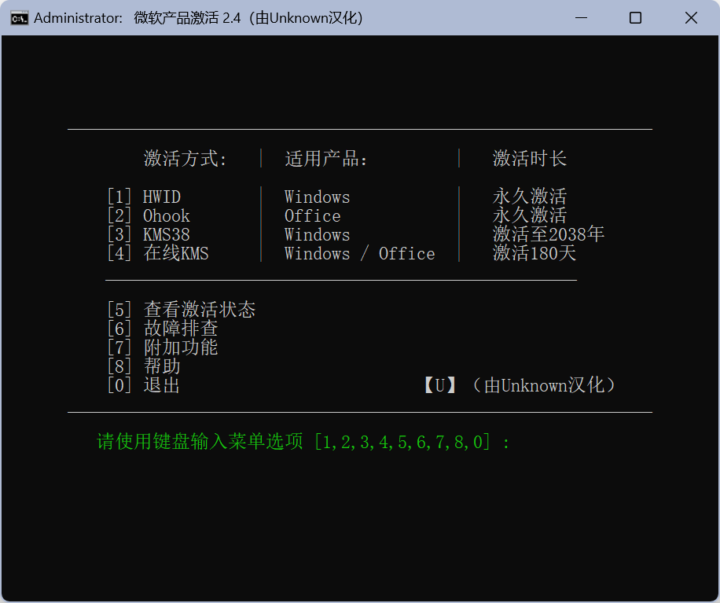

<p align="center"></p>

<h1 align="center">Microsoft  Activation  Scripts (MAS)（Unknown汉化）</h1>

<h1 align="center">微软产品激活工具(MAS)</h1>

<p align="center">一款使用 HWID / Ohook / KMS38 / 在线 KMS 激活方法的 Windows 和 Office 激活工具，注重开源代码和较少的杀毒软件检测。</p>
<hr>


### 注意：HWID 激活现已采用新方法重新启用。

## 下载/使用方法：

### 方法1 - 传统方式（汉化版）

- 从 [此处](https://github.com/UnknownU0/Microsoft-Activation-Scripts-CN/archive/refs/heads/master.zip) 下载文件。

- 右键单击已下载的 zip 文件并解压缩。

- 在提取的文件夹中，找到名为“多合一版本”的文件夹。

- 运行名为“微软产品激活工具.cmd”的文件。

- 您将看到激活选项，并按照屏幕上的指示操作。

- 就这样。

  ```
  汉化版本：2.4
  原作者发布日期：2023年10月21日
  汉化日期：2023年10月28日
  ```

  ## 

### 方法2 - PowerShell（英文原版）

-   在 Windows 8.1/10/11 上，右键单击 Windows 开始菜单，选择 PowerShell 或终端（不是 CMD）。
-   复制粘贴下面的代码并按回车键
    `irm https://massgrave.dev/get | iex`
-   您将看到激活选项，并按照屏幕上的指示操作。
-   就这样。

要以无人值守模式运行脚本，请查看[此处](https://massgrave.dev/command_line_switches.html)。

## 说明：

本项目为汉化项目，仅将原项目中的`All-In-One-Version/MAS_AIO.cmd`汉化为`多合一版本/微软产品激活工具.cmd`。

原项目为massgravel发布的Microsoft-Activation-Scripts项目，项目地址为https://github.com/massgravel/Microsoft-Activation-Scripts。


### [原项目提供的故障排查 / 帮助](https://massgrave.dev/troubleshoot.html)

### [下载原版 Windows 和 Office](https://massgrave.dev/genuine-installation-media.html)
### 原项目主页 - https://massgrave.dev
</br>

---

<p align="center">由热爱强力驱动 ❤️</p>
